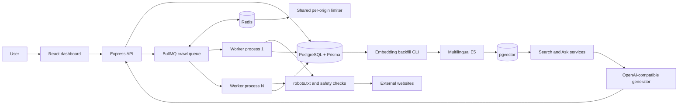
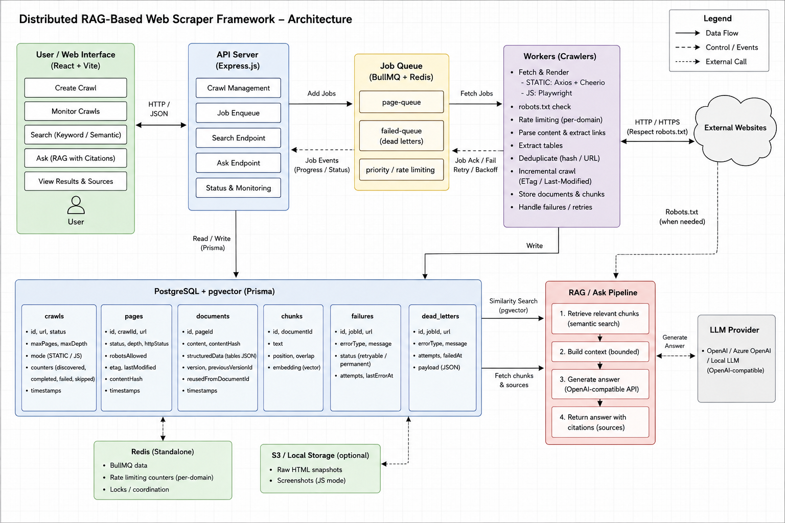
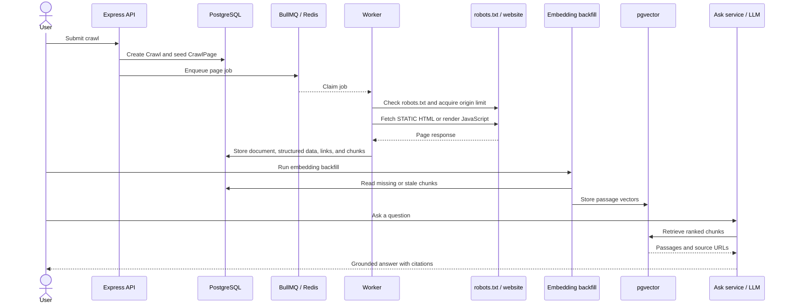
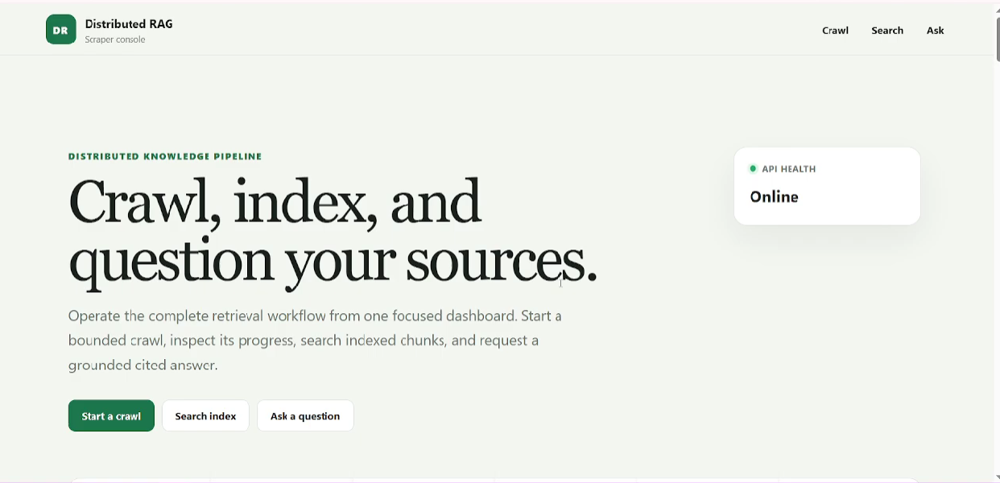
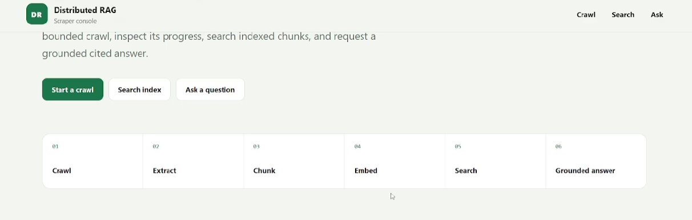
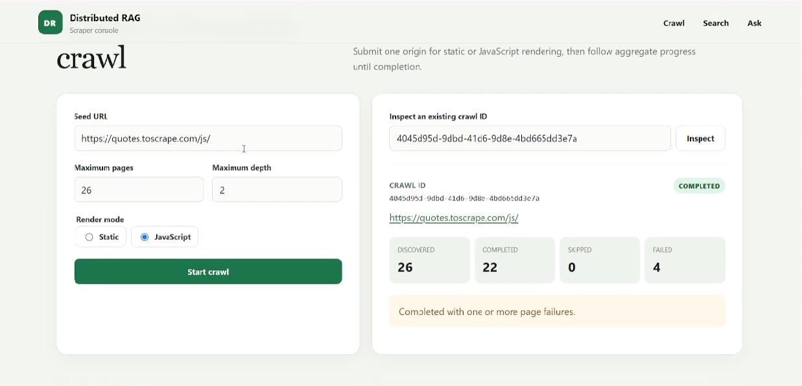
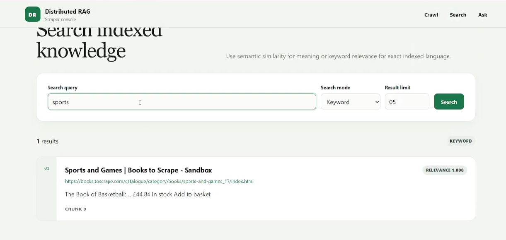
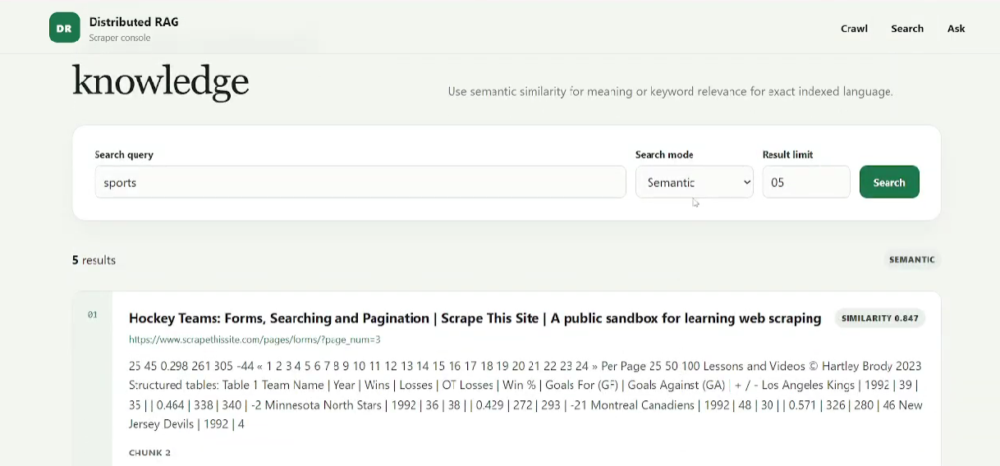
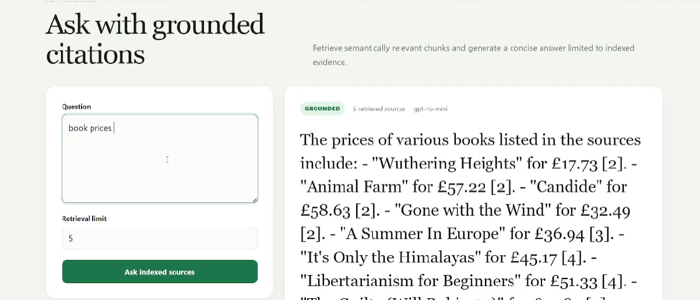

# Distributed RAG-Based Web Scraper Framework

## Final Project Report

| Field | Value |
|---|---|
| Assignment | Distributed web scraping and retrieval-augmented generation |
| Repository | `NourFakih/distributed-rag-scraper` |
| Author | Nour Fakih |
| Submission date | July 26, 2026 |

---

## Abstract

This project implements a distributed web-crawling and Retrieval-Augmented Generation (RAG) platform using TypeScript, Express, React, BullMQ, Redis, PostgreSQL, Prisma, `pgvector`, Axios, Cheerio, Playwright, multilingual E5 embeddings, and an OpenAI-compatible generation provider. Users can submit bounded crawl jobs, monitor their progress, search indexed content using keyword or semantic retrieval, and ask questions grounded in scraped material with source citations.

The crawler supports static HTML and JavaScript-rendered pages, `robots.txt` checks, shared per-origin rate limiting, retries, exponential backoff, durable dead letters, structured HTML-table extraction, URL and content deduplication, and incremental STATIC recrawling with retained document history. Evaluation included a 500-page Books to Scrape crawl that completed all requested pages without failures, a static-versus-JavaScript comparison on Quotes to Scrape, and a one-worker versus three-worker scaling benchmark. Three workers improved throughput by 7.2%, although globally shared politeness limits restricted the speedup. The project demonstrates the complete crawl-to-RAG workflow; formal retrieval-quality evaluation, multi-host deployment, and verified evidence from a third public website remain limitations.

---

## 1. Introduction and Objectives

Modern systems often need to collect information from multiple websites and make it searchable or answerable in natural language. A basic sequential scraper can download pages, but it becomes difficult to manage when crawling must be durable, polite, resumable, fault tolerant, and horizontally scalable. RAG adds another layer: downloaded pages must be cleaned, divided into useful passages, embedded, retrieved, and passed to a language model without losing the source information needed for citations.

This project addresses these requirements through one integrated TypeScript system. A React client submits crawl requests to an Express API. The API validates and stores each request, then places asynchronous work on Redis-backed BullMQ queues. Independent worker processes retrieve pages, respect crawl policies, discover eligible links, and persist documents and chunks in PostgreSQL. An explicit embedding backfill then generates E5 vectors for semantic retrieval. Search and Ask endpoints retrieve relevant passages and return traceable results.

The main objectives were to:

1. provide a typed API for creating and monitoring bounded crawl jobs;
2. separate request handling from crawl execution through durable queues and independent workers;
3. support static HTML and JavaScript-rendered pages;
4. enforce `robots.txt`, page-count, depth, same-origin, and per-origin rate limits;
5. persist crawls, pages, documents, chunks, structured tables, and version history in PostgreSQL;
6. support keyword search, semantic search, and cited RAG answers;
7. expose the workflow through a React dashboard;
8. evaluate a 500-page crawl, JavaScript rendering, fault handling, and horizontal scaling; and
9. document limitations honestly rather than treating architectural concurrency as proof of linear scaling.

---

## 2. Requirements Coverage

The table below summarises the assignment requirements and the available evidence.

| Requirement | Status | Implementation or evidence |
|---|---|---|
| Static HTML crawling | Completed | Axios, Cheerio, and the 500-page Books to Scrape crawl |
| JavaScript-rendered crawling | Completed | Playwright and the Quotes to Scrape rendering comparison |
| At least three websites | Evidence required | Saved evidence currently establishes only Books to Scrape and Quotes to Scrape |
| 500+ page or equivalent crawl | Completed | 500 discovered and 500 completed pages |
| `robots.txt` and shared politeness | Partially completed | Implemented and tested; site-specific terms-of-service evidence still needs confirmation |
| Multiple independent workers | Partially completed | Independent worker processes were demonstrated on one host |
| Horizontal scaling | Completed | One-worker versus three-worker benchmark |
| Retries, backoff, and dead letters | Completed | Temporary/permanent failure handling and integration tests |
| Deduplication and incremental recrawling | Completed | URL normalisation, hashes, validators, reuse, and version links |
| Multiple content types | Completed | Body text and structured HTML tables |
| Deliberate chunking and vector search | Completed | Overlapping chunks, E5 vectors, and `pgvector` |
| Keyword and semantic search | Completed | PostgreSQL full-text search and vector similarity |
| Grounded Ask with citations | Completed | Retrieved evidence, bounded context, and cited responses |
| Multi-source synthesis | Partially completed | Supported by the Ask context, but no saved cross-site evaluation |
| Measurable retrieval quality | Not evaluated | No labelled Recall@k, Hit Rate@k, or MRR benchmark |
| API and web interface | Completed | Express routes and React dashboard |
| Worker/node crash recovery experiment | Partially completed | Durable queues and idempotent retries exist; physical node-loss recovery was not demonstrated |
| Multi-host distributed deployment | Not evaluated | Scaling used multiple processes on one host |
| Architecture and workflow diagrams | Completed | Included below |
| Narrated project video | Evidence required | To be submitted separately |

---

## 3. Architecture and Technology Choices

### 3.1 System architecture

The repository is a Node.js and TypeScript monorepo. The React application communicates with the Express API. The API validates requests, creates resources, returns status, performs search, and exposes the Ask endpoint. Long crawls are not executed inside HTTP request handlers; they are persisted and sent to BullMQ.

Workers run as independent operating-system processes. Each worker connects to the same Redis and PostgreSQL services. BullMQ provides distributed job ownership and retries, while Redis also coordinates the global per-origin limiter. PostgreSQL is the durable source of truth for crawls, pages, documents, chunks, dead letters, structured tables, validators, and version links. Prisma provides typed access and committed migrations, and `pgvector` stores and searches embeddings.

> **Screenshot 1 — Architecture and sequence diagrams:** 

### 3.2 End-to-end sequence

### 3.3 Technology choices

| Component | Selected technology | Alternative considered | Reason for selection |
|---|---|---|---|
| Runtime | TypeScript/Node.js | Python | One typed language across React, API, and workers; strong asynchronous I/O support |
| API | Express | FastAPI or NestJS | Lightweight, explicit middleware and validation, suitable for an assignment-scale API |
| Queue | BullMQ/Redis | Celery or RabbitMQ | Native TypeScript integration, retries, independent workers, and shared Redis already used for rate limiting |
| Database | PostgreSQL/Prisma | MongoDB | Transactions, constraints, migrations, JSONB, relational provenance, and vectors in one store |
| Vector store | `pgvector` | Qdrant, Weaviate, or Pinecone | Keeps embeddings beside chunks and source metadata without another consistency boundary |
| Static parser | Axios/Cheerio | Browser-only crawling | Faster and less resource-intensive when content is already in HTML |
| JavaScript renderer | Playwright | Puppeteer or Selenium | Modern browser automation in the same TypeScript stack |
| Frontend | React/Vite | Server-rendered templates | Interactive crawl polling, search, Ask, and shared TypeScript tooling |
| Infrastructure | Docker Compose | Kubernetes or managed cloud services | Reproducible local deployment without unnecessary orchestration complexity |
| Embeddings | Local multilingual E5 | Hosted embedding API | Avoids sending content to an external embedding service and produces fixed 384-dimensional vectors |

---

## 4. Distributed Crawling System

### 4.1 Crawl lifecycle

A crawl starts when a client submits a seed URL, `maxPages`, `maxDepth`, and `renderMode` to `POST /api/crawls`. The API validates the payload, creates the crawl and root page in PostgreSQL, and enqueues the first BullMQ job. Returning immediately prevents a long crawl from keeping an HTTP request open.

A worker claims the job, checks crawl policy, retrieves the page, extracts content and links, persists the result, and reserves eligible child pages. `maxDepth` bounds traversal depth, while `maxPages` provides a deterministic workload ceiling. URLs are normalised and deduplicated before being scheduled, and transactional reservation prevents concurrent workers from exceeding the configured page limit.

> **Screenshot 2 — Dashboard and static crawl:**  
>  

### 4.2 Static and JavaScript rendering

STATIC mode uses Axios and Cheerio. It is the preferred path when meaningful content is present in the server response because it avoids browser startup and consumes fewer resources.

JavaScript mode uses Playwright and Chromium. It is required when the initial HTML is only an application shell and the visible content is inserted after script execution. In the saved Quotes to Scrape comparison, static extraction produced 22 cleaned characters, while JavaScript rendering produced 1,423 characters. This demonstrates why both modes are necessary.

> **Screenshot 3 — JavaScript crawl:**  

### 4.3 Politeness, safety, and ethics

Before fetching a page, the worker checks `robots.txt` and acquires permission from a Redis-backed per-origin limiter. Because the limiter is shared across all workers, increasing the number of workers does not multiply the request rate to a single site. This preserves responsible crawling but limits the maximum speedup for single-origin workloads.

The HTTP layer also validates redirects, DNS results, private-IP targets, response sizes, content types, and same-origin behaviour. Unsupported or unsafe targets are rejected instead of being repeatedly retried. The implementation documents responsible crawl controls, while site-specific terms-of-service evidence must still be confirmed for the final submission.

### 4.4 Fault tolerance

Retryable failures—including throttling, temporary server errors, network failures, and browser timeouts—use BullMQ retries with `Retry-After` support or bounded exponential backoff. Permanent problems such as unsafe targets, invalid redirects, unsupported content, or oversized responses are not repeatedly retried.

After retry exhaustion, the worker stores one durable dead-letter record in PostgreSQL. The record includes the page, crawl, job, failure category, bounded error information, attempt count, and failure time. Idempotent redelivery prevents duplicate terminal records. Integration tests verified HTTP 503 retry exhaustion, permanent unsupported-content handling, and idempotent redelivery.

### 4.5 Structured content extraction

The processing stage handles body text and HTML tables. Cheerio extracts up to 20 top-level tables per page. Each table may retain a caption, headers, and rows, with limits of 200 rows, 30 cells per row, and 1,000 characters per cell. Zod validates the resulting JSON before persistence.

Structured tables are stored in `Document.structuredData`. A readable table representation is also appended to the cleaned text so keyword search, semantic search, and RAG can retrieve values contained in table cells.

### 4.6 Incremental STATIC recrawling

For repeated STATIC crawls, the worker retrieves the newest previous document for the same normalised URL. Stored ETag and Last-Modified values are sent through `If-None-Match` and `If-Modified-Since`.

An HTTP 304 response reuses the earlier document and chunks. If a server returns HTTP 200 but the SHA-256 content hash is unchanged, the previous document is also reused. The new crawl page is marked with `notModified` and `reusedDocumentId`. When content changes, a new document is created with `previousVersionId` pointing to the previous version, so history is retained instead of overwritten. Conditional recrawling is currently limited to STATIC mode.

> **Screenshot 5 — Structured tables and incremental reuse: 
>  

---

## 5. Processing, Search, and RAG

### 5.1 Cleaning and chunking

Raw HTML contains scripts, styles, navigation, and repeated page elements that are unsuitable for retrieval. The processing pipeline removes unnecessary markup, normalises whitespace, stores source metadata, and creates chunks during document persistence.

The chunker targets 1,000 characters with a 150-character overlap. It prefers paragraph, line, or whitespace boundaries and records offsets and SHA-256 hashes. This is an overlap-based strategy rather than semantic topic segmentation: it preserves local context across boundaries but creates some repeated text.

### 5.2 Embeddings and vector indexing

Embeddings are not generated automatically during crawling. After chunks exist, an operator runs the embedding backfill CLI. It processes missing or stale chunks in deterministic batches, generates multilingual E5 passage vectors, and stores model metadata, content hashes, and normalised 384-dimensional embeddings.

`pgvector` stores the vectors and uses a cosine HNSW index. Semantic search embeds the query, filters out missing or stale vectors, and returns ranked chunks with source metadata. Newly crawled chunks are not semantically searchable until the backfill completes. Keyword mode remains available through PostgreSQL full-text search without embeddings.

### 5.3 Grounded question answering

The Ask path embeds the user question, retrieves relevant chunks, builds bounded grounding context, and sends that evidence to an OpenAI-compatible generation provider. The response includes citations linked to the retrieved source URLs. Citation markers are validated, and the system can return an insufficient-evidence response rather than generating an unsupported answer.

A manual demonstration returned ranked sports-book results and a cited answer identifying *The Book of Basketball* at £44.84 and in stock. This is qualitative evidence of integration, not a formal retrieval-quality benchmark. No labelled Recall@k, Hit Rate@k, or MRR evaluation was completed.

> **Screenshot 6 — Semantic search and grounded Ask:**  

---

## 6. API and Web Interface

The Express API provides the following implemented routes:

| Method | Endpoint | Purpose |
|---|---|---|
| `GET` | `/health` | Return API health |
| `POST` | `/api/crawls` | Create and enqueue a crawl |
| `GET` | `/api/crawls/:id` | Return crawl status, limits, and counters |
| `GET` | `/api/crawls/:id/pages` | Return paginated crawl pages |
| `GET` | `/api/crawls/:id/dead-letters` | Return crawl dead letters |
| `GET` | `/api/dead-letters/:id` | Return one dead-letter record |
| `GET` | `/api/documents/:id` | Return raw, cleaned, structured, and version metadata |
| `GET` | `/api/search` | Run keyword or semantic search |
| `POST` | `/api/ask` | Return a grounded answer with cited sources |

The React dashboard connects to these routes and allows users to submit crawls, monitor progress, inspect pages, perform keyword and semantic search, and ask grounded questions. The interface separates asynchronous crawl submission from status polling and retrieval.

---

## 7. Security, Testing, and Reproducibility

Configuration is supplied through environment variables, and credentials are not stored in the report. Docker Compose runs the API, web client, workers, Redis, PostgreSQL, and migrations. GitHub Actions validates repository changes, while committed Prisma migrations keep database structure reproducible.

The standard validation recorded 209 passing tests, with 22 explicitly gated environment-dependent tests skipped. Tests cover URL handling, validation, parsing, link discovery, retries, dead letters, static and JavaScript rendering, politeness, chunking, backfills, search, Ask, and the React dashboard.

The scaling benchmark was designed not to damage active data. It recreated only the temporary database `distributed_rag_scaling`, flushed only Redis logical database 14, and started process-scoped API and worker instances. The active database and Redis data remained untouched.

---

## 8. Evaluation and Results

### 8.1 Five-hundred-page crawl

The Books to Scrape STATIC crawl used `maxPages: 500` and `maxDepth: 4`. According to the saved evidence, it discovered and completed all 500 pages, with zero skipped and zero failed pages, in 500.018 seconds. This validates bounded pagination, URL deduplication, concurrent discovery, and consistent crawl counters.

### 8.2 Rendering comparison

For `https://quotes.toscrape.com/js/`, static extraction produced 22 cleaned characters, while Playwright rendering produced 1,423. Because the target and objective were identical, the difference directly demonstrates content that was unavailable in the initial HTML response.

### 8.3 Horizontal scaling

The same concurrent two-origin workload was executed with one worker and then three independent workers. Each round started from an isolated empty PostgreSQL database and Redis logical database, preventing incremental recrawling from biasing the second result.

| Workers | Crawls | Discovered | Completed | Failed | Duration | Pages/second |
|---:|---:|---:|---:|---:|---:|---:|
| 1 | 2 | 70 | 64 | 6 | 59.982 s | 1.067 |
| 3 | 2 | 70 | 64 | 6 | 55.933 s | 1.144 |

The three-worker round achieved a 1.072× speedup and a 7.2% throughput improvement. Both rounds completed the same number of pages and had the same six failures, supporting workload equivalence. The improvement was modest because all workers shared per-origin politeness limits and the experiment depended on public-site latency and crawl topology.

### 8.4 Retrieval evaluation

Keyword search, semantic search, insufficient-evidence handling, and cited Ask responses were demonstrated qualitatively. However, no labelled dataset was used to calculate Recall@k, Hit Rate@k, MRR, citation precision, or answer correctness. The project therefore claims functional retrieval and grounding, not measured RAG accuracy.

---

## 9. Limitations and Future Work

The saved public-site evidence currently covers only Books to Scrape and Quotes to Scrape. A third verified website must be added to satisfy the assignment requirement fully. These websites are also intentionally scraper-friendly and do not represent authentication, anti-bot systems, complex sitemaps, or highly irregular production pages.

The scaling experiment used several independent processes on one host. It demonstrates BullMQ coordination and horizontal process scaling but not deployment across multiple machines or availability zones. Shared CPU, memory, network, and database resources remained common to all workers.

Retrieval evaluation was qualitative. A stronger study should define labelled questions and expected passages, then measure Recall@k, Hit Rate@k, MRR, answer correctness, citation precision, and citation completeness. Multi-source synthesis should also be evaluated using questions that require evidence from more than one website.

Future work includes:

- adding a verified third website;
- extending conditional and hash-aware recrawling to JavaScript mode;
- scheduling automatic recrawls and embedding backfills;
- supporting broader content types such as linked documents and PDFs;
- repeating scaling experiments across several hosts and more origins;
- adding authentication, authorisation, quotas, TLS, and secret management;
- adding tracing, metrics, queue dashboards, alerts, and dead-letter workflows; and
- building a labelled retrieval and citation-evaluation benchmark.

---

## 10. Conclusion

This project delivers an end-to-end distributed crawler and RAG platform. It supports static and JavaScript-rendered pages, bounded multi-page crawling, shared politeness controls, retries and durable dead letters, structured table extraction, incremental STATIC recrawling, keyword and semantic search, and cited question answering.

The system completed a 500-page crawl without skipped or failed pages, recovered substantially more content through JavaScript rendering on a dynamic page, and achieved a measured 7.2% throughput improvement with three independent workers. The result was intentionally limited by responsible per-origin rate limiting.

The project is a strong assignment-scale demonstration rather than a complete production platform. Its remaining gaps—third-site evidence, labelled retrieval evaluation, multi-host deployment, automatic embedding scheduling, and broader production security—are clearly identified and provide a practical direction for future work.

---

## Screenshot Checklist

- [ ] Screenshot 1 — Architecture and sequence diagrams
- [ ] Screenshot 2 — Dashboard and completed STATIC crawl
- [ ] Screenshot 3 — JavaScript crawl
- [ ] Screenshot 4 — Dead letter and successful CI
- [ ] Screenshot 5 — Structured table and incremental reuse
- [ ] Screenshot 6 — Semantic search and grounded Ask
- [ ] Screenshot 7 — Full dashboard
- [ ] Screenshot 8 — 500-page crawl and scaling results
- [ ] Third website result and screenshot
