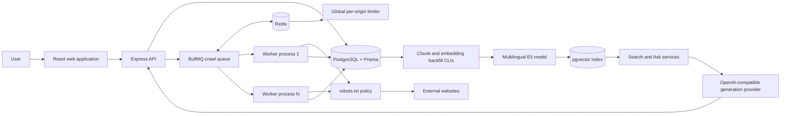
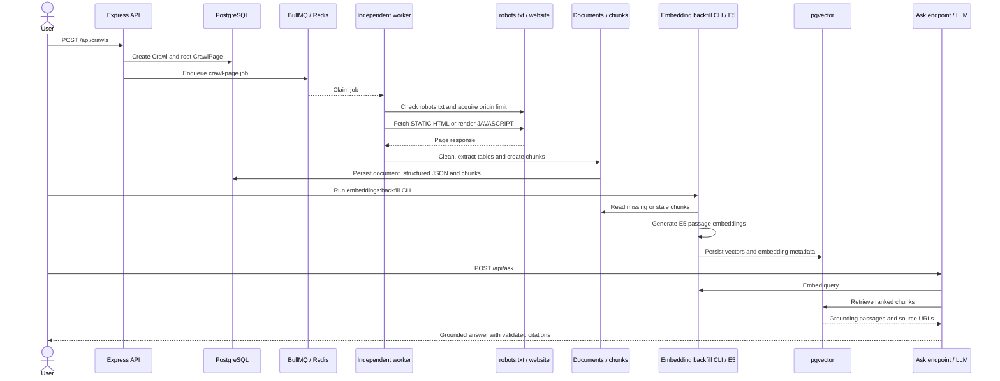

# Distributed RAG-Based Web Scraper Framework

## Final Project Report

| Field | Value |
|---|---|
| Course | *[Insert course]* |
| Instructor | *[Insert instructor]* |
| Module / assignment | Distributed web scraping and retrieval-augmented generation |
| Project repository | `distributed-rag-scraper` |
| Author | Nour Fakih |
| Student number | *[Insert student number]* |
| Submission date | July 26, 2026 |

---

## Abstract

This project implements a distributed web-crawling and retrieval-augmented generation (RAG) platform. It combines an Express and TypeScript API, independent BullMQ workers, Redis coordination, PostgreSQL persistence through Prisma, vector search with `pgvector`, a React administration interface, static HTML extraction with Axios and Cheerio, JavaScript rendering with Playwright, multilingual E5 embeddings, and an OpenAI-compatible answer-generation interface. The system accepts crawl requests, enforces per-origin politeness, discovers and normalises links, stores cleaned documents, indexes chunks, retrieves semantically related evidence and produces answers with source citations.

The evaluation uses repository evidence from controlled experiments. A 500-page static crawl of Books to Scrape discovered and completed all 500 requested pages with no skipped or failed pages in 500.018 seconds. A rendering comparison on Quotes to Scrape’s JavaScript route produced only 22 cleaned characters in static mode but 1,423 characters with JavaScript rendering, demonstrating why both crawl modes are needed. A reproducible horizontal-scaling benchmark compared the same two-origin, 70-page workload with one and three independent worker processes. One worker completed 64 pages in 59.982 seconds (1.067 pages/s), while three workers completed the same 64 pages in 55.933 seconds (1.144 pages/s), a 1.072× speedup and 7.2% throughput improvement. Six pages failed in both rounds, so the comparison remains workload-equivalent but also exposes target-site and crawl-policy effects. The modest gain is consistent with globally shared per-origin limits: more workers increase scheduling capacity but cannot legitimately bypass politeness constraints.

The resulting system demonstrates the complete distributed pipeline and provides auditable operational evidence. Its principal limitations are the absence of verified evidence from a third public website, limited formal retrieval-quality measurement, dependence on public-site variability, and the need for broader production security and observability work.

## 1. Introduction

Modern information systems often need to collect content from multiple websites and make that content searchable or answerable in natural language. A sequential scraper can be sufficient for a small demonstration, but it becomes difficult to operate when crawling must be durable, polite, resumable and horizontally scalable. RAG adds a further requirement: downloaded pages must be cleaned, divided into useful passages, embedded, retrieved and presented to a language model without losing the provenance needed for citations.

This project addresses those requirements as one integrated TypeScript system. Clients create crawl jobs through an HTTP API. The API validates and persists each request, then places work on Redis-backed BullMQ queues. Independently running worker processes retrieve pages, respect `robots.txt` and shared per-origin limits, discover further links within configured constraints, and persist crawl results in PostgreSQL. Document persistence creates chunks; an explicit backfill CLI subsequently generates their vector embeddings. Search and question-answering endpoints retrieve the most relevant evidence and return traceable results.

This report documents the architecture, engineering decisions, implementation and observed behaviour. Claims about performance are tied to saved experiment artifacts rather than inferred from the design. In particular, the scaling experiment uses identical fresh workloads and isolated state for both rounds so incremental recrawling cannot give the three-worker case an artificial advantage.

## 2. Problem Definition

The assignment requires more than downloading HTML. The system must coordinate concurrent work, avoid duplicate processing, preserve crawl state, respect web-server constraints, handle static and client-rendered pages, and support semantic retrieval over the resulting corpus. These concerns interact. Increasing worker count without a global origin limiter could make a benchmark appear faster while violating crawl politeness. Retaining documents between rounds could make the second round look faster because unchanged pages are skipped. Generating an answer without document references would make the RAG result difficult to audit.

The core problem is therefore to design a reproducible, distributed pipeline that transforms a bounded set of public web pages into persistent, searchable evidence while maintaining responsible crawl behaviour and exposing enough metrics to evaluate correctness and throughput.

The implementation is constrained by practical realities. Public websites can return transient errors or change structure. JavaScript execution consumes more memory and time than static parsing. Vector generation and LLM calls may depend on external models and credentials. PostgreSQL and Redis contain active application state that must not be damaged during experiments. The design isolates benchmark data, keeps secrets outside reports and logs, and interprets results in light of these limits.

## 3. Aim and Objectives

The project aim is to build and evaluate a distributed RAG-based web scraper that can crawl public content responsibly, index it for semantic retrieval, and answer questions with citations.

The objectives are:

1. Provide a typed API for creating and monitoring bounded crawl jobs.
2. Separate request handling from crawl execution through durable Redis queues and independent workers.
3. Support static HTML extraction and browser-based JavaScript rendering.
4. Enforce `robots.txt`, depth, page-count and per-origin rate limits.
5. Persist crawl, document and retrieval data in PostgreSQL without losing provenance.
6. Build a RAG pipeline using chunking, embeddings, vector similarity and cited answer generation.
7. Expose operational state through API endpoints and a React interface.
8. Evaluate a substantial crawl, demonstrate rendering-mode differences, and compare one-worker with three-worker throughput using an identical workload.
9. Record limitations honestly rather than treating architectural concurrency as proof of linear speedup.

## 4. Requirements Analysis

### 4.1 Functional requirements

The platform must accept a seed URL and crawl policy, create a crawl record, and report progress through terminal completion or failure. Policy includes the maximum number of pages, maximum link depth and rendering mode. Workers must fetch allowed pages, clean meaningful page content, identify eligible links, and prevent duplicate URLs from consuming the cap. The system must store enough metadata to associate documents with source URLs and crawl jobs.

For retrieval, stored text must be chunked and embedded. Users must be able to submit a semantic query and receive ranked source passages. The answering path must use retrieved passages as context and include citations or source references. Operationally, users need health information, crawl status, metrics and a dashboard view.

### 4.2 Non-functional requirements

The primary non-functional requirements are safety, reproducibility, scalability and politeness. Queue-backed work should survive process separation, while several workers should consume shared queues without duplicating ownership. Rate limiting must be coordinated across workers, not merely enforced within each process. Database operations must be persistent and schema-controlled through committed migrations.

Experiments must be repeatable. Both scaling rounds must start from the same empty benchmark database and Redis logical database, submit the same crawl definitions concurrently, and measure only crawl wall-clock time. Active application data must remain untouched. Secrets, particularly the LLM API key, must never appear in output or generated evidence.

Maintainability is supported by TypeScript, shared packages, explicit boundaries and automated tests. The platform should fail visibly: invalid inputs, terminal crawl failures and timeouts must not be silently converted into success.

## 5. Requirements Traceability

The following table maps the assignment requirements to repository implementation and available evidence. The status vocabulary is deliberately limited to **Completed**, **Partially completed**, **Evidence required**, and **Not evaluated**. “Completed” means the implementation and supporting repository evidence are present; it does not imply production certification.

| Assignment requirement | Status | Repository implementation or evidence |
|---|---|---|
| Individual source repository and documented implementation | Completed | TypeScript monorepo, migrations, Dockerfiles, Compose configuration, tests and documentation are present. |
| CI runs linting/tests and verifies container builds | Completed | `.github/workflows/ci.yml` and `.github/workflows/docker-build.yml`. |
| Independently containerised API, web and worker components | Completed | Component Dockerfiles and `docker-compose.yml`. |
| Static HTML crawling and parsing | Completed | Axios-based HTTP client, STATIC scraper, Cheerio cleaning and the Books to Scrape evidence. |
| JavaScript-rendered crawling | Completed | Playwright renderer and the saved Quotes to Scrape STATIC/JavaScript comparison. |
| Test at least three different websites | Evidence required | Saved evidence establishes only Books to Scrape and Quotes to Scrape; the third-site editor warning is retained. |
| One site with 500+ pages or practical equivalent | Completed | `docs/evidence/books-500-summary.txt` records 500 discovered and 500 completed pages. |
| `robots.txt`, terms and per-domain politeness | Partially completed | `robots.txt`, redirects and a Redis-backed global per-origin limiter are implemented and tested; site-specific terms-of-service evidence still requires editorial confirmation. |
| Deduplication and incremental recrawling | Completed | Normalised URL uniqueness, content hashes, STATIC conditional requests, document reuse and retained version links are implemented and tested. |
| Multiple independent worker instances | Partially completed | Independent worker processes sharing BullMQ, Redis and PostgreSQL are demonstrated on one host; separate-host deployment is not demonstrated. |
| Horizontal-scaling improvement | Completed | Saved benchmark reports 1.072× speedup and 7.2% throughput improvement for the equivalent workload. |
| Fault tolerance, retries, backoff and dead letters | Completed | Retry categories, three attempts, `Retry-After`, exponential fallback, permanent failures, durable dead letters and vertical-slice tests are present. |
| More than plain paragraphs / structured data | Completed | HTML tables are extracted as validated JSON and serialized into searchable text. |
| Basic document version history | Completed | `previousVersionId` links changed documents; unchanged STATIC recrawls reuse earlier documents. |
| Deliberate overlapping chunking | Completed | Boundary-aware chunks target 1,000 characters with 150-character overlap and store offsets/hashes. |
| Vector index and semantic retrieval | Completed | E5 embeddings, the embedding backfill CLI, `pgvector` HNSW index and semantic-search route are implemented. |
| Grounded Ask endpoint with citations | Completed | `POST /api/ask` retrieves sources, bounds context, validates citation markers and returns cited metadata. |
| Multi-source synthesis | Partially completed | The Ask service can pass multiple retrieved sources to the generator; no saved evaluation demonstrates a question requiring synthesis across websites. |
| Measurable retrieval quality | Not evaluated | No Recall@k, Hit Rate@k or MRR artifact is present; current retrieval evidence is qualitative only. |
| API for raw data, status, search and Ask | Completed | Existing Express routes are listed in Section 18. |
| Basic connected web interface | Completed | React dashboard, crawl, search and Ask views are present. |
| Graceful recovery from worker/node failure | Partially completed | Durable queued jobs, retries and idempotent redelivery are implemented; an actual worker/node crash-and-recovery experiment is not documented. |
| Multi-host genuinely distributed deployment | Not evaluated | The recorded scaling experiment uses independent processes on one host. |
| Narrated video covering each project phase | Evidence required | Video evidence is outside the repository evidence reviewed for this report. |
| Architecture and workflow diagrams | Completed | Mermaid architecture and sequence diagrams are included below. |

## 6. Technology Choices and Alternatives

These choices describe the implemented repository. Alternatives are architectural comparisons, not claims that comparative benchmarks were performed.

| Selected technology | Alternative(s) | Rationale and trade-off |
|---|---|---|
| TypeScript on Node.js | Python | TypeScript provides one language and shared types across React, Express and workers, while Node’s asynchronous I/O suits HTTP crawling. Python has mature scraping and ML libraries and could simplify some model integration, but would either split the stack by language or require replacing the existing typed web/server packages. Node does not remove CPU-bound model costs, so embedding work is handled explicitly by a CLI. |
| Express | FastAPI or NestJS | Express is small, familiar and allows explicit middleware, Zod schemas and route/controller/service boundaries without extensive framework ceremony. FastAPI offers excellent Python typing and generated OpenAPI but conflicts with the single TypeScript stack. NestJS offers stronger dependency-injection conventions and larger-team structure, but adds abstraction that was unnecessary for this assignment-sized API. |
| BullMQ over Redis | Celery or RabbitMQ | BullMQ integrates directly with TypeScript, provides durable Redis-backed jobs, retries, custom backoff and separate worker processes. Celery is mature but primarily Python-oriented. RabbitMQ is a dedicated broker with rich routing and acknowledgements, but would add another service while Redis is already required for shared rate limiting. Redis persistence and operational configuration still need production care. |
| PostgreSQL with Prisma | MongoDB | PostgreSQL provides transactions, constraints, JSONB for structured tables and vector support in one durable store. Prisma supplies typed access and committed migrations. MongoDB naturally stores heterogeneous documents, but relational crawl/page/version relationships and uniqueness rules would require application-level discipline, and vectors would likely introduce a different indexing path. |
| `pgvector` | Dedicated vector database such as Qdrant, Weaviate or Pinecone | `pgvector` keeps embeddings beside chunks and source metadata, simplifying consistent filtering and citations. A dedicated vector database may scale or tune approximate search more independently, but introduces deployment, cost and cross-database consistency concerns that the demonstrated workload does not justify. |
| Cheerio for STATIC pages | Browser-only crawling | Cheerio is fast and low-overhead when HTML already contains content. A browser-only approach has broader rendering coverage but consumes more CPU and memory and would slow ordinary static pages. The measured Quotes comparison demonstrates the need for a selectable browser path rather than replacing static parsing. |
| Playwright | Puppeteer or Selenium | Playwright supplies Chromium automation, navigation controls and modern browser isolation in the TypeScript stack. Puppeteer is a close Chromium-focused alternative with a smaller conceptual surface. Selenium supports many languages and browsers but generally requires more driver infrastructure. No cross-browser comparison was evaluated. |
| React client | Server-rendered UI | React fits the existing TypeScript toolchain and supports interactive polling, crawl status, search and Ask workflows. Server-rendered templates could reduce frontend build complexity and improve first-response rendering, but would couple UI rendering more tightly to the API. The current interface is operational rather than a usability benchmark. |
| Docker Compose | Cloud orchestration such as Kubernetes or managed container services | Compose makes PostgreSQL, Redis and component containers reproducible on one development host. Cloud orchestration would add multi-host scheduling, autoscaling and recovery primitives, but also operational complexity and cost. Because it was not deployed, multi-host behaviour remains not evaluated. |
| Local multilingual E5 embeddings | Hosted embedding API | E5 avoids sending indexed page content to a hosted embedding service and provides a fixed 384-dimensional representation compatible with the schema. Hosted embeddings reduce local model setup and may offer managed scale, but add cost, data-governance concerns, network dependence and provider coupling. The current backfill CLI makes embedding generation an explicit operational step rather than an automatic crawl-stage queue. |

## 7. System Architecture

The repository is a Node.js and TypeScript monorepo. Its major runtime components are the web application, API, one or more workers, Redis and PostgreSQL. The React application communicates with the Express API. The API owns validation, resource creation, status and retrieval endpoints; it does not perform long crawls inside the request-response lifecycle. Instead, it records jobs and publishes asynchronous work to BullMQ.

Workers are independent operating-system processes running the same built worker entry point. Each connects to the same Redis and PostgreSQL instances. BullMQ provides distributed queue ownership, retries and job coordination. Redis also supports shared crawl-control state such as origin-aware limiting. PostgreSQL is the source of truth for crawls, pages, documents and chunks. Prisma provides the data model and committed migration history; `pgvector` supports similarity search over embeddings.



This division permits horizontal scaling at the worker tier while keeping the public API stable. It also makes the benchmark meaningful: one and three worker processes execute identical production crawl logic and share the same infrastructure rather than using a special fast path.

> **Screenshot placeholder S1 — Architecture:** Render or capture the Mermaid architecture diagram showing the UI, API, BullMQ/Redis, independent workers, PostgreSQL, backfill CLI, E5, pgvector and generation provider.

### 7.1 End-to-end sequence

The sequence separates crawl-time chunk creation from the explicit embedding-backfill operation. The Ask endpoint becomes useful after chunks have embeddings.



> **Screenshot placeholder S2 — Sequence diagram:** Render or capture the Mermaid sequence from crawl submission through cited answering.

## 8. Data Model and Persistence

PostgreSQL stores durable state so queue messages are not the only record of work. Crawl records capture the seed, limits, mode, status and counters required to report discovered, completed, skipped and failed pages. Page and document records retain source identity and cleaned content. Chunk records maintain the relationship between retrieval-sized text and the original document, enabling search results and generated answers to cite their sources.

Prisma supplies a versioned schema and migration workflow. This matters for deployment and experimentation: a benchmark database can be recreated and migrated to precisely the schema expected by the code. Vector support is provided by PostgreSQL’s `pgvector` extension and migration SQL. Keeping relational metadata and vectors together simplifies provenance-preserving queries and avoids another consistency boundary.

Persistent URL state also supports crawl correctness. Canonicalised URLs and uniqueness constraints reduce the risk that syntactic variations cause repeated fetches. Transactional updates allow counters and page outcomes to remain observable even when individual jobs fail. Redis is deliberately non-authoritative for content: it coordinates transient execution, whereas PostgreSQL preserves the reportable result.

## 9. Crawl Submission and Lifecycle

A crawl begins when a client posts to `/api/crawls`. The payload specifies the seed URL, `maxPages`, `maxDepth` and `renderMode`. The API validates it, creates the crawl record, and submits initial work to BullMQ. Returning control at this point prevents a long crawl from holding an HTTP connection open.

Workers progress the crawl by claiming jobs, fetching pages, extracting content and discovering permitted links. A crawl is terminal only when eligible work has resolved and its status becomes `COMPLETED` or `FAILED`. Counters distinguish discovery from successful completion because a URL may be discovered and later skipped or fail. API polling and the dashboard expose this lifecycle to users and experiment scripts.

`maxDepth` prevents unlimited traversal away from the seed, and `maxPages` provides a deterministic workload ceiling. Link normalisation and de-duplication stop the same logical page repeatedly entering the queue. These controls turn an open-ended website graph into a bounded, measurable job.

> **Screenshot placeholder S3 — Static crawl:** Insert a STATIC crawl submission and completed crawl detail, with seed, page/depth limits, status and counters visible.

## 10. Static and JavaScript Rendering

Static mode uses Axios to request HTML and Cheerio to parse it. This lightweight path is appropriate when meaningful text is present in the server response. It avoids browser startup and typically offers better throughput and resource use. The crawler removes non-content elements, extracts cleaned text and discovers links.

JavaScript mode uses Playwright to load the page in a browser context and obtain content after client-side execution. This is necessary for applications whose initial response contains only a shell and whose visible text is inserted later. Browser rendering is more expensive, so it should be selected deliberately rather than used for every page.

The recorded comparison demonstrates the functional difference. On `https://quotes.toscrape.com/js/`, STATIC mode yielded only 22 cleaned characters, whereas JS mode yielded 1,423. The difference shows that static retrieval missed the dynamically rendered quotations. Supporting both modes improves coverage while allowing server-rendered sites to use the cheaper path.

> **Screenshot placeholder S4 — JavaScript crawl:** Insert the Quotes to Scrape JavaScript-mode crawl and retrieved rendered document, with the target URL and mode visible.

## 11. Structured HTML-Table Extraction

The processing path handles HTML tables as a distinct structured content type rather than flattening every page into undifferentiated paragraphs. Cheerio locates up to 20 top-level tables per page. For each table, the extractor reads a direct `<caption>` when present, identifies the first header row in `<thead>` or the first row containing `<th>` cells, and captures the remaining rows without accidentally folding nested-table rows into their parent.

Resource limits are enforced before persistence: at most 200 rows per table, 30 cells per row and 1,000 normalised characters per cell. These bounds limit JSON and retrieval-context growth on hostile or unusually large pages. The result has the shape `{ tables: [{ caption, headers, rows }] }`. A strict Zod schema validates the object, array sizes, nullable caption and bounded strings. Validation occurs in the extraction function before the processed page reaches database persistence.

The `Document.structuredData` JSONB column stores the validated JSON so consumers can retain captions, headers and row boundaries. In parallel, `serializeStructuredContent` creates a readable representation headed by “Structured tables”; it labels each table, includes the caption, joins headers and cells with separators, and appends the serialization to cleaned document text. Chunks and keyword/semantic search can therefore discover table values while the API can still return structured JSON from `GET /api/documents/:id`. Unit tests cover caption/header/row extraction, headerless tables, empty results, nested tables and every configured limit. This is implementation evidence; the report does not claim a saved public-site table experiment.

> **Screenshot placeholder S7 — Structured table extraction:** Insert a document API response or test/demo showing a table caption, headers and rows in `structuredData`, plus its searchable textual serialization.

## 12. Incremental STATIC Recrawling

Incremental behaviour is implemented for STATIC crawls. Before fetching a normalised URL, the worker locates the most recently fetched earlier `Document` for that URL. Stored `etag` and `lastModified` values become `If-None-Match` and `If-Modified-Since` request headers. If the server returns HTTP 304 and a previous document exists, no new document or chunks are created. The new `CrawlPage` is completed with `notModified: true` and `reusedDocumentId` pointing to the existing document; earlier raw HTML is also reused for link discovery. A 304 without a previous document is treated as a permanent error because it cannot be resolved safely.

Conditional validators are not the only reuse path. If a successful 2xx response produces the same cleaned-content hash as the previous document, the worker performs the same reuse operation. Thus a site that omits validators can still avoid duplicating unchanged content. Because the existing document and its existing chunks are referenced, reuse does not create duplicate chunks.

When content changes, a new `Document` is created for the new crawl page. Its `previousVersionId` points to the prior document, which is retained rather than overwritten. Chunks are synchronized transactionally for the new document; the unique `(documentId, chunkIndex)` key and exact synchronization logic prevent duplicate chunk rows for a document. `reusedDocumentId`, `previousVersionId`, ETag, Last-Modified and not-modified state are exposed through existing API responses. Vertical-slice tests cover validator-based 304 reuse, same-hash reuse, retained history, changed-content versions and chunk replacement.

This optimisation is intentionally STATIC-only. The JavaScript branch renders through Playwright and does not load or send conditional validators or execute the same-hash previous-document reuse path. Extending conditional and hash-aware recrawling to JavaScript mode is future work.

> **Screenshot placeholder S8 — Incremental reuse:** Insert API/database evidence from a repeated STATIC crawl showing `notModified`, `reusedDocumentId`, ETag/Last-Modified behaviour or a `previousVersionId` chain.

## 13. Responsible Crawling and Rate Limiting

The crawler respects `robots.txt` and its configured per-origin rate limiter. Before requesting protected resources, workers use site rules to determine whether access is allowed. Disallowed URLs are not counted as successful pages. This protects site owners’ expressed preferences and makes skipped outcomes explicit.

Politeness must remain correct with several workers. A limiter local to each process would multiply the effective request rate whenever a worker starts. The system instead coordinates requests globally per origin through shared infrastructure. Three workers can make progress on different origins or non-network stages, but they cannot collectively exceed the permitted rate for one origin.

This design directly affects evaluation. The workload spans Books to Scrape and Quotes to Scrape so workers have independent origins available. Even so, speedup is only 1.072×. That is an honest result: worker scaling improves available concurrency, while shared politeness and external response times impose upper bounds. Production behaviour was not weakened to manufacture a faster benchmark.

## 14. Distributed Workers and Fault Tolerance

BullMQ decouples producers from consumers. The API enqueues a crawl-page identifier without selecting an executor; any connected worker can claim the job from shared Redis. Worker processes can start, stop or scale independently of the API. Default job policy allows three attempts and retains failed BullMQ jobs instead of automatically deleting them.

Retry behaviour distinguishes transient from permanent failures. HTTP 429, 502, 503 and 504 responses, network timeouts, connection resets, temporary DNS faults, browser timeouts/crashes and unavailable robots/rate-limit services are represented as retryable categories. `Retry-After` is parsed as delta seconds or an HTTP date and, when valid, takes priority up to a 24-hour cap. Otherwise the custom BullMQ strategy uses exponential delays beginning at one second and capped at 60 seconds. Permanent categories—including unsafe targets, same-origin violations, invalid URLs/redirects, ordinary permanent HTTP errors, unsupported content types, oversized responses and empty content—use `UnrecoverableError` so repeating an unsafe or deterministic failure does not waste attempts.

When retries are exhausted, the worker transactionally marks the page failed and upserts one durable PostgreSQL `DeadLetter`. The record includes crawl/page/job identifiers, bounded serialized payload, failure category, bounded error message, attempt count and failure time. The unique crawl-page key and no-op upsert update make terminal redelivery idempotent: an already completed page returns its existing document, and an already terminally failed page cannot create a second dead letter. API routes expose the collection for a crawl and an individual dead-letter record.

Fault handling is verified at several levels. Retry-policy tests cover both forms of `Retry-After` and exponential fallback. HTTP client tests map transient status codes. The vertical-slice integration suite drives a fixture endpoint that returns HTTP 503, observes all three attempts, confirms the failed BullMQ job and exactly one durable dead letter, then redelivers it to verify idempotency. Another fixture returns a non-HTML content type and confirms it becomes `UNSUPPORTED_CONTENT_TYPE` after one attempt, demonstrating permanent-error handling. These tests establish retry and dead-letter behaviour; the report does not claim that a physical node-loss recovery experiment was performed.

The scaling benchmark uses independent worker processes on one host. Round A starts one `node packages/workers/dist/index.js`, and Round B starts three separate invocations with individual PIDs/logs. All share BullMQ/Redis and PostgreSQL. This demonstrates process independence and shared-queue coordination, but multi-host deployment and recovery are not evaluated.

> **Screenshot placeholder S6 — Dead-letter evidence:** Insert the HTTP 503 vertical-slice result or API response showing category `HTTP_503`, three attempts and one durable dead letter; redact any credentials.

## 15. Content Processing and Deduplication

Raw HTML is unsuitable as retrieval context because navigation, scripts, styles and repeated page furniture can dominate relevant text. The extraction pipeline parses the response, removes irrelevant elements and stores cleaned text with source metadata. Link extraction occurs from the parsed document, but links are normalised and checked against crawl scope before scheduling.

URL-level deduplication prevents repeated variants from inflating work. Content identity and update metadata support incremental operation: previously stored pages can be recognised and unchanged content need not be unnecessarily re-indexed. This is useful in normal operation but creates benchmark risk. If Round B reused Round A’s documents, an incremental path could bias the scaling result.

The experiment removes this bias by dropping and recreating only `distributed_rag_scaling` before each round and flushing only Redis logical database 14. Both rounds begin without benchmark history, run the same migrations and submit the same crawl specifications. The active `distributed_rag` database and active Redis data remain untouched.

## 16. Embeddings and Vector Indexing

Cleaned documents are chunked during document persistence. The implemented boundary-aware algorithm targets 1,000 characters with 150 characters of overlap, prefers paragraph, line or whitespace boundaries, avoids splitting UTF-16 surrogate pairs, and records each chunk’s index, offsets and SHA-256 content hash. This is an overlap-based strategy rather than semantic topic segmentation: it preserves local context across boundaries at the cost of repeated text and additional vectors.

Embeddings are **not** generated automatically by a BullMQ indexing pipeline. After chunks exist, an operator runs `npm run embeddings:backfill`, which builds and executes `packages/workers/dist/src/cli/embeddings-backfill.js`. The CLI scans chunks in deterministic batches and skips an embedding only when the stored model, model version and embedded content hash still match. It first requests a batch of passage embeddings; after a batch failure it retries individual chunks, and it reports inspected, embedded, skipped and failed counts. Persistence includes an optimistic content-hash condition so a vector is not attached to content that changed during backfill.

The active E5 provider formats passages and queries according to E5 conventions, returns normalised 384-dimensional vectors, and records model/version metadata. The Prisma schema uses `vector(384)`, while the migration creates a cosine HNSW index for populated rows. At query time, semantic search embeds the question directly, filters out missing or stale vectors, and ranks cosine distance with a stable chunk-ID tie-breaker. Keyword mode uses PostgreSQL full-text search without embeddings. This separation means newly crawled chunks are not semantically searchable until the backfill CLI succeeds; automatic or scheduled embedding is future operational work.

## 17. Retrieval-Augmented Generation

The RAG path begins with a question. The system embeds it, performs vector similarity search, and assembles the highest-ranked chunks as evidence. An OpenAI-compatible language-model request receives the question and bounded context, with instructions to answer from that context. The response includes citations connecting claims to retrieved URLs.

Repository tests establish the search response contract, stale-embedding filters, controlled vector ordering, bounded grounding sources and citation-marker validation. They do not measure retrieval quality on a labelled real-world question set. No saved Recall@k, Hit Rate@k or mean reciprocal rank (MRR) artifact was found, so retrieval quality is **not evaluated** quantitatively in this report. A manual search or Ask screenshot may demonstrate qualitative plausibility only and must not be presented as a metric.

A stronger evaluation would define labelled questions, expected source chunks and acceptable answers; measure Recall@k, Hit Rate@k and MRR; and separately assess answer correctness, faithfulness and citation entailment. Similarity values are ranking signals rather than calibrated probabilities. Until such evidence exists, the report claims implemented retrieval and grounding behaviour, not measured RAG accuracy.

> **Screenshot placeholder S9 — Semantic search:** Insert an actual semantic-search response showing the query, ranked excerpts, similarity values and source URLs. Label it qualitative evidence unless a documented benchmark is added.

> **Screenshot placeholder S10 — Grounded Ask:** Insert an actual Ask response showing the question, grounded answer, numbered citations and matching source URLs. Label it qualitative evidence.

## 18. API and User Interface

The Express API is the boundary through which the UI, scripts and external clients interact with the platform. Input validation prevents malformed crawl definitions from reaching the queue, and structured errors distinguish validation problems from runtime failures. The table below is derived from the existing Express route modules; it does not list proposed endpoints.

| Method | Endpoint | Implemented purpose |
|---|---|---|
| `GET` | `/health` | Return API service health. |
| `POST` | `/api/crawls` | Validate a crawl request, persist its root page and enqueue it; returns HTTP 202. |
| `GET` | `/api/crawls/:id` | Return crawl status, limits, counters, root-page outcome and incremental-reuse metadata. |
| `GET` | `/api/crawls/:id/pages` | Return paginated crawl pages and their statuses, attempts, document links and errors. |
| `GET` | `/api/crawls/:id/dead-letters` | Return paginated durable dead letters belonging to a crawl. |
| `GET` | `/api/dead-letters/:id` | Return one durable dead-letter record. |
| `GET` | `/api/documents/:id` | Return raw HTML, cleaned content, structured JSON, hashes, validators and version metadata. |
| `GET` | `/api/search` | Run validated keyword or semantic search using query parameters. |
| `POST` | `/api/ask` | Retrieve evidence and return a grounded generated answer with cited source metadata. |

The React interface makes the workflow observable without direct database or Redis access. Users can configure crawls, inspect counters, search indexed material, and ask questions against retrieved evidence. It also illustrates the separation between initiating asynchronous work and observing its progress.

For reproducibility, the benchmark does not automate through the browser. It submits crawls directly and immediately through `http://localhost:3100/api/crawls`, then polls machine-readable responses. This avoids UI timing noise while exercising the same API and worker pipeline.

> **Screenshot placeholder S11 — Dashboard:** Insert the React dashboard showing crawl submission/status plus navigation to search and Ask functionality.

## 19. Security and Operational Safety

Configuration is supplied through environment variables rather than embedded credentials. Database, Redis and model-provider settings can differ by environment. The report and benchmark never print the LLM API key. The scaling script overrides only process-local `PORT`, `DATABASE_URL` and `REDIS_URL`; it does not edit `.env`.

The benchmark has narrow destructive scope. It verifies existing PostgreSQL and Redis Compose services but never runs `docker compose down -v`. Reset commands target the literal temporary database `distributed_rag_scaling`, never active `distributed_rag`. Redis cleanup selects logical database 14 and issues `FLUSHDB`, not `FLUSHALL`. API and worker PIDs are tracked in a temporary directory, and the cleanup trap stops only those benchmark processes.

These safeguards preserve the existing 500-page crawl and indexed data. They also make failures safer: health failures, migration failures, reset failures, crawl timeouts and unexpected terminal failures cause a non-zero exit while process cleanup still runs.

Production deployment requires further controls, including authentication, authorisation, quotas, TLS, secret-manager integration, network restrictions, audit logs and stronger browser sandboxing. The current implementation should be assessed as an assignment system rather than an internet-facing multi-tenant service.

## 20. Testing Strategy

Testing spans unit, integration and end-to-end concerns. Unit tests cover deterministic behaviour such as URL handling, parsing, validation and utilities. Integration tests exercise component boundaries including persistence and queues. Opt-in end-to-end tests cover runtime services where PostgreSQL, Redis, browser support or model infrastructure is required.

The non-public test run completed successfully: 209 tests passed across 29 test files, while 22 opt-in tests in seven files were skipped. Skips represent explicitly gated environment-dependent suites rather than failures. Build validation compiles all packages, shell validation checks benchmark syntax, and `git diff --check` detects whitespace defects.

Tests do not replace experiment evidence. The 500-page crawl validates bounded traversal at meaningful scale, the rendering comparison validates client-side execution, and the scaling benchmark validates independent worker coordination. Public-site experiments are less deterministic than local tests, so both forms are necessary.

> **Screenshot placeholder S12 — CI:** Insert a successful GitHub Actions run showing the repository CI checks; do not substitute a local command output for CI evidence.

## 21. Experimental Methodology

Three evidence categories are used. A substantial Books to Scrape run evaluates bounded crawl completion. The same dynamic Quotes to Scrape page is fetched in STATIC and JS modes to isolate rendering behaviour. Finally, a two-round benchmark measures whether additional independent workers improve crawl throughput.

The scaling workload is identical in both rounds and is submitted concurrently:

| Seed URL | Maximum pages | Maximum depth | Mode |
|---|---:|---:|---|
| `https://books.toscrape.com/` | 40 | 3 | STATIC |
| `https://quotes.toscrape.com/` | 30 | 3 | STATIC |

An optional third URL can be supplied through an environment variable but was not part of the recorded comparison. Two default origins are meaningful because per-origin limiting otherwise serialises most network activity.

Before each round, the script stops only prior benchmark processes, recreates `distributed_rag_scaling`, flushes Redis database 14, and applies committed Prisma migrations. It starts the built API on port 3100, waits for health, then starts one or three separate worker processes. Timing starts immediately before the first submission and ends only after every crawl reaches `COMPLETED` or `FAILED`; migration and API startup are excluded.

Each round records worker count, crawl count, requested cap, crawl IDs, statuses, discovered/completed/skipped/failed pages, duration and pages per second. The script checks workload signatures match and that pages complete. This controls cached state and incremental recrawl bias, although it cannot remove public network variability.

> **Screenshot placeholder S13 — Scaling experiment:** Insert the final terminal or Markdown comparison table showing the one-worker and three-worker results, speedup and throughput improvement.

## 22. Results

### 22.1 Five-hundred-page crawl

The Books to Scrape STATIC crawl used `maxPages: 500` and `maxDepth: 4`. It discovered 500 pages and completed all 500, with zero skipped and zero failed pages. Duration was 500.018 seconds, approximately 1.000 completed page per second. This verifies a substantial page cap, traversal beyond the seed and consistent completion counters.

> **Screenshot placeholder S5 — 500-page crawl:** Insert the completed Books to Scrape crawl showing the 500-page cap, terminal status and discovered/completed/skipped/failed counters.

### 22.2 Rendering comparison

For `https://quotes.toscrape.com/js/`, static extraction produced 22 cleaned characters. JavaScript rendering produced 1,423. Because target and objective were the same, the richer JS result directly demonstrates content absent from the initial HTML response.

### 22.3 Horizontal scaling

| Workers | Crawls | Requested cap | Discovered | Completed pages | Skipped | Failed | Duration (s) | Pages/s |
|---:|---:|---:|---:|---:|---:|---:|---:|---:|
| 1 | 2 | 70 | 70 | 64 | 0 | 6 | 59.982 | 1.067 |
| 3 | 2 | 70 | 70 | 64 | 0 | 6 | 55.933 | 1.144 |

```text
speedup = one-worker duration / three-worker duration
        = 59.982 / 55.933
        = 1.072x

improvement = ((three-worker pages/s / one-worker pages/s) - 1) * 100
            = ((1.144 / 1.067) - 1) * 100
            = 7.2%
```

The three-worker round completed the equivalent workload 4.049 seconds sooner and increased measured throughput by 7.2%. Both rounds discovered 70 pages, completed 64 and failed six, supporting comparability. The failures must nevertheless be acknowledged: the benchmark proves improvement for the same observed workload, not perfect crawl success.

## 23. Discussion

The results support the claim that additional workers improve total throughput, but not linear scaling. A threefold worker count delivered a 1.072× speedup. This is reasonable for the architecture and workload. Requests to each origin remain globally rate-limited, so three workers cannot issue three times as many requests to either site. Only overlap across origins, queue latency, parsing, database work and idle intervals is available for parallelisation.

The benchmark design is more important than the headline percentage. Recreating the temporary database and flushing only the dedicated Redis database ensures Round B cannot benefit from Round A’s cached or incremental pages. Invoking the same built API and worker entry points avoids modifying crawler behaviour solely for measurement. Identical failures and completions mean the comparison uses the same effective outcome as well as the same cap.

The 500-page experiment provides stronger evidence of capacity than the 70-page scaling run, while the scaling run provides stronger causal evidence about worker count. The rendering test separately verifies a feature throughput cannot establish. Together, the experiments cover scale, functional breadth and distributed behaviour.

The retrieval demonstration is useful but less rigorous. A relevant top result and correctly cited product answer demonstrate connectivity, not broad accuracy. Future work should not present qualitative RAG screenshots as statistical evidence; a labelled set and citation checks would strengthen this aspect.

## 24. Limitations

Books to Scrape and Quotes to Scrape are intentionally scrape-friendly demonstration sites. They do not represent authentication, anti-bot measures, complex sitemaps, irregular markup or large production domains. Public network conditions and responses may also change between runs.

The worker experiment runs several processes on one machine. It proves queue-mediated process independence and shared-state coordination, but not deployment across multiple hosts or zones. CPU, memory, network and database capacity remain shared. The workload is short, so noise can have a noticeable effect even though startup is excluded.

Global per-origin politeness intentionally limits speedup. A workload with more origins may scale better; a single-origin workload may show almost none. Six of 70 pages failed in both rounds. Equal failures preserve comparative fairness, but production analysis should classify their causes. Retrieval has no labelled quality benchmark, and generation depends on model availability and behaviour. Finally, only two public websites are supported by saved evidence.

> **EDITOR ACTION REQUIRED — Third website evidence:** Add the third tested website, its crawl mode, purpose, result and screenshot before submission.

## 25. Future Work

Distributed deployment should be tested across separate containers or hosts with controlled resources. Longer experiments should use more origins, repeat each condition, randomise round order and report confidence intervals. Failure classification should distinguish robots exclusions, HTTP errors, timeouts, parsing problems and exhausted retries.

The crawl layer could add sitemap ingestion, configurable canonicalisation, extend conditional and hash-aware recrawling to JavaScript mode, add scheduled recrawls, support richer content types, and introduce extraction adapters. Operational improvements include authenticated APIs, role-based access, quotas, tracing, queue dashboards, alerts, dead-letter workflows and cancellation.

For RAG, a curated evaluation collection should include questions, expected passages and acceptable answers. Retrieval recall@k, mean reciprocal rank, answer correctness, citation precision and citation completeness could then be measured. Chunking, embedding models and rerankers could be compared empirically.

A verified third website must be added before academic submission, chosen to broaden coverage rather than repeat an existing static crawl. A suitable target would exercise a different structure or rendering pattern while explicitly permitting responsible automated access.

## 26. Conclusion

The project delivers a coherent distributed crawler and RAG architecture using TypeScript, Express, React, BullMQ, Redis, PostgreSQL, Prisma, `pgvector`, Axios, Cheerio, Playwright, E5 embeddings and an OpenAI-compatible interface. Its boundaries allow API requests, crawling, persistence, indexing and answering to evolve independently while preserving provenance.

Evidence supports the principal claims. The system completed a 500-page static crawl without skipped or failed pages. JavaScript mode recovered substantially more content than static mode on a client-rendered page. Three independent workers improved the identical two-origin benchmark from 59.982 to 55.933 seconds, giving a 1.072× speedup and 7.2% throughput improvement. The modest gain is consistent with responsible global per-origin rate limiting.

The system is therefore a strong assignment-scale demonstration of distributed crawling and evidence-grounded retrieval. It is not yet a complete production crawler or fully evaluated question-answering service. Its explicit limitations, isolated benchmark and reproducible artifacts provide a credible foundation for further work.

---

## Appendix A. Reproduction Commands

```bash
npm run build
bash -n scripts/run-scaling-experiment.sh
git diff --check
```

Review help without running a crawl:

```bash
bash scripts/run-scaling-experiment.sh --help
```

Run the public scaling experiment only after confirming it is appropriate:

```bash
bash scripts/run-scaling-experiment.sh
```

Optionally include a third seed in both rounds:

```bash
SCALING_THIRD_URL='https://example.org/' bash scripts/run-scaling-experiment.sh
```

Results are written to `artifacts/scaling-results.md`.

## Appendix B. Evidence Register

| Evidence | Repository location | Claim supported |
|---|---|---|
| 500-page crawl summary | `docs/evidence/books-500-summary.txt` | 500 discovered/completed; zero skipped/failed; 500.018 s |
| Rendering comparison | `docs/evidence/javascript-rendering-comparison.txt` | STATIC 22 characters; JS 1,423 characters |
| Scaling report | `artifacts/scaling-results.md` | Equivalent worker metrics, speedup and throughput |
| Benchmark runner | `scripts/run-scaling-experiment.sh` | Isolation, topology, workload and calculations |
| Repository tests | Test runner output | 209 passed; 22 opt-in skipped |

## Appendix C. Screenshot Checklist

- [ ] S1 — Architecture diagram
- [ ] S2 — Sequence diagram
- [ ] S3 — Static crawl
- [ ] S4 — JavaScript crawl
- [ ] S5 — 500-page crawl
- [ ] S6 — Dead-letter evidence
- [ ] S7 — Structured table extraction
- [ ] S8 — Incremental reuse
- [ ] S9 — Semantic search
- [ ] S10 — Grounded Ask
- [ ] S11 — Dashboard
- [ ] S12 — CI
- [ ] S13 — Scaling results
- [ ] Third website evidence and screenshot added
